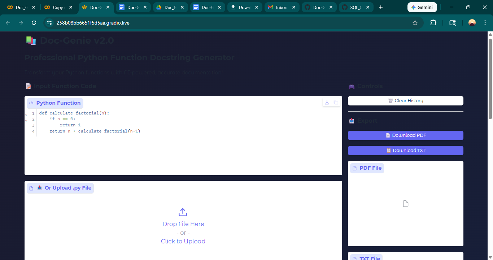

 DocGenie – AI Python Docstring Generator

 Description
DocGenie is an AI-powered tool that analyzes Python functions and automatically generates professional docstrings.

 Technologies Used
- Python
- Gradio
- HuggingFace Transformers
- IBM Granite Model
 Application Preview

 Installation

Clone the repository:

git clone https://github.com/Sriram-ug/Doc-Genie.git

Install dependencies:

pip install -r requirements.txt

 Usage
Run the notebook and generate docstrings for Python functions automatically.
